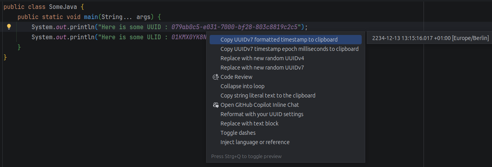
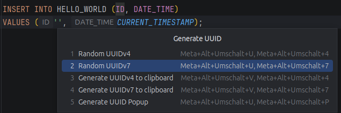
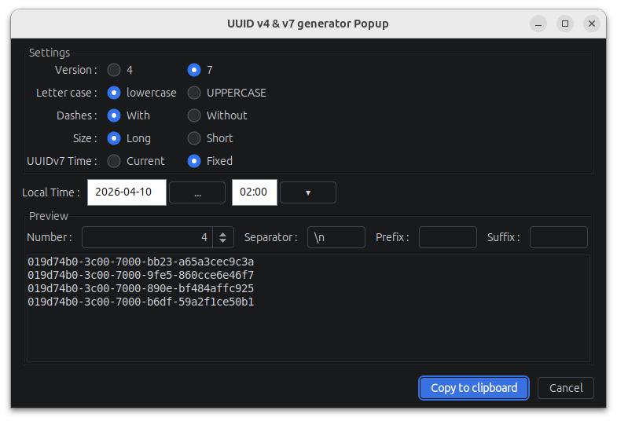
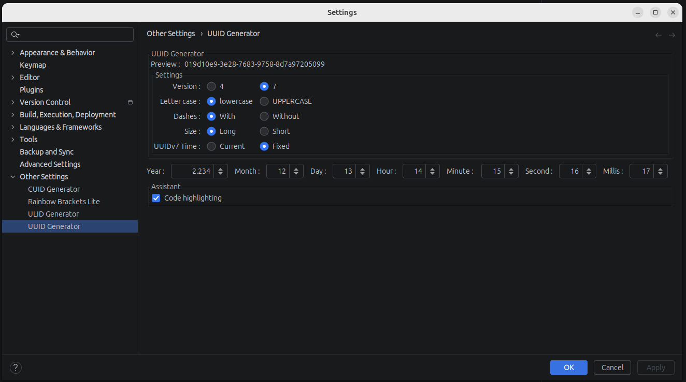
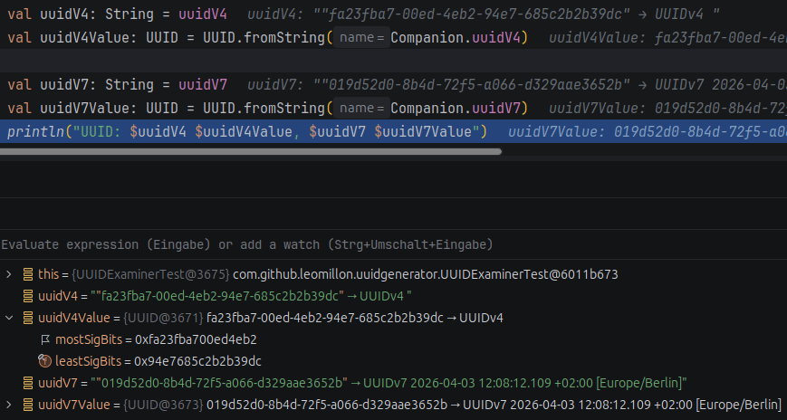

    

<h1 align="center">Intellij UUID Generator</h1>
<ul>
    <li>UUID
      <ul>
        <li>Version 4 <a href="https://en.wikipedia.org/wiki/Universally_unique_identifier#Version_4_(random)">Wiki</a>,
            <a href="https://tools.ietf.org/html/rfc4122">RFC</a></li>
        <li>Version 7 <a href="https://en.wikipedia.org/wiki/Universally_unique_identifier#Version_7_(timestamp_and_random)">Wiki</a></li>
      </ul>
    </li>
    <li>ULID <a href="https://github.com/ulid/spec">ULID</a></li>
    <li>CUID <a href="https://github.com/ericelliott/cuid">CUID</a></li>
</ul>
generator plugin for IntelliJ based IDEs.

    
    
    
    
    
    

## JetBrains plugin

Link to the official plugin page : [UUID Generator](https://plugins.jetbrains.com/plugin/8320-uuid-generator)

## Description

<!-- Plugin description -->
UUID [Version 4](https://tools.ietf.org/html/rfc4122),
[Version 7](https://en.wikipedia.org/wiki/Universally_unique_identifier#Version_7_(timestamp_and_random));
[ULID](https://github.com/ulid/spec)
and [CUID](https://github.com/ericelliott/cuid) generator plugin for IntelliJ based IDEs.

For example : `123e4567-e89b-12d3-a456-426655440000`.
    
You will find it in the **Generate popup** -> **Random UUIDv4**.

## Available actions

- Random `UUIDv4` / `UUIDv7` / `ULID` / `CUID` (also as quick fix)
- Generate `UUIDv4` / `UUIDv7` / `ULID` / `CUID` to clipboard
- Generate `UUIDv4` / `UUIDv7` / `ULID` / `CUID` Popup
- Toggle `UUID` dashes (also as quick fix)
- Reformat `UUID` / `CUID` with settings (also as quick fix)
- Replace Distinct `UUID`s in Selection
- Replace Random `UUID` / `ULID` / `CUID` Placeholders in Selection

`UUID`/`ULID`/`CUID` highlight in any language with context info (Timestamp extraction for `UUIDv7` and `ULID`) and
quick fix suggestions

## Demo

- `UUID` / `ULID` / `CUID` highlight

- `UUID` / `ULID` / `CUID` quick fixes

- Random `UUIDv4` / `UUIDv7` generation

- `UUID` Generate Popup

- Multi-caret support

- Toggle dashes

- `UUID` to clipboard

- `UUID` format settings dialogue

- ID placeholders highlight

- ID placeholders replacement action

- Live debugger insights

## Contributors

Special thanks to:

- [Davide Maggio (DVDAndroid)](https://plugins.jetbrains.com/author/683c57fa-d7ec-4d24-ae4d-82442d3aa75a)

<!-- Plugin description end -->
